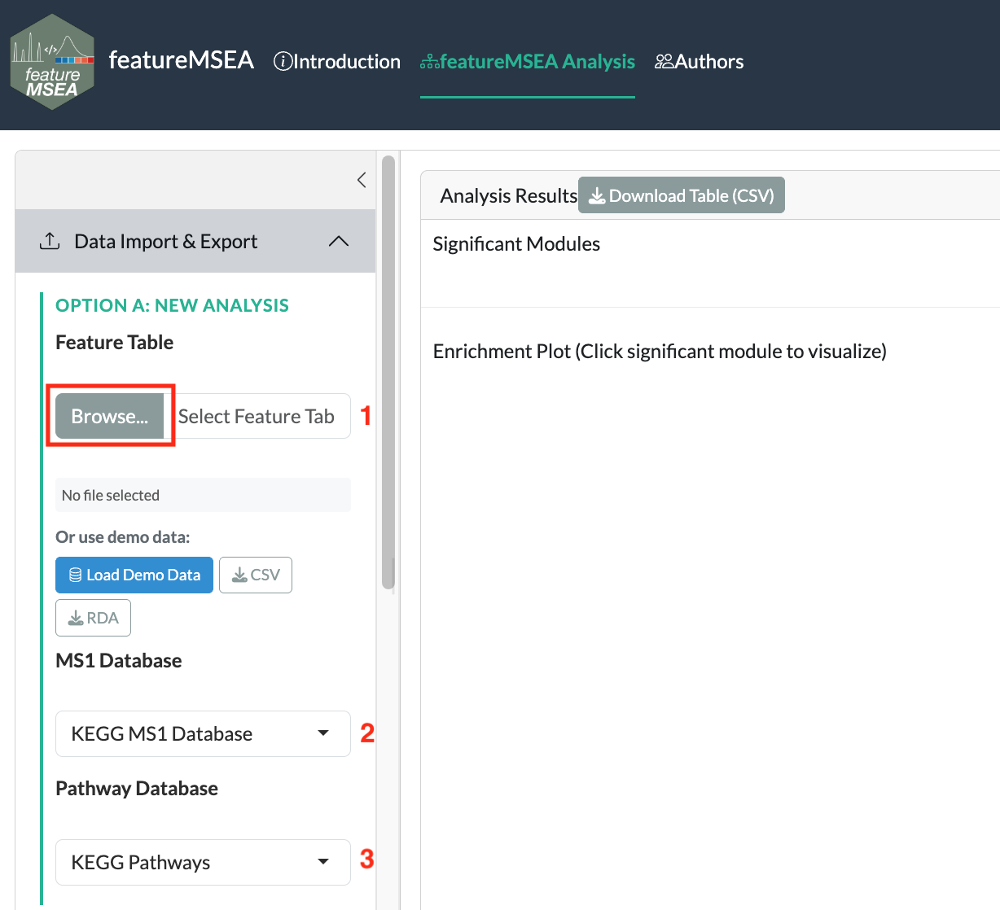
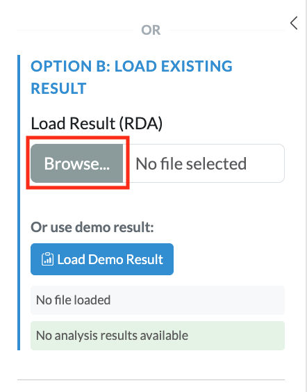

# Summary of Inputs {#inputs}

featureMSEA requires three inputs: a **feature table** from your LC-MS experiment, an **MS1 metabolite database** for annotation, and a **metabolite set database** for enrichment testing.

## Feature Table {#feature-table}

The feature table is the primary input and can be provided as either an `.rda` file (containing a data frame) or a `.csv` file. Each row represents one metabolic feature detected in your LC-MS experiment. The following columns are required:

| Column | Type | Description |
|--------|------|-------------|
| `variable_id` | character | Unique identifier for each metabolic feature |
| `mz` | numeric | Measured mass-to-charge ratio (*m/z*) |
| `rt` | numeric | Retention time in **seconds** |
| `condition` | numeric | Phenotype-associated ranking statistic — use the absolute value of an effect-size measure such as signal-to-noise ratio (\|SNR\|), fold-change (\|log₂FC\|), or correlation coefficient (\|r\|) |
| `polarity` | character | Ion mode: `"positive"` or `"negative"` |
| `mean_intensity` | numeric | Average feature intensity across all samples |

> **Note on `condition`:** featureMSEA ranks features in descending order by the `condition` value before running enrichment, such that features with larger values are ranked higher and contribute more strongly to the enrichment score. The `condition` column should contain the absolute value of a phenotype-associated statistic, such as |SNR|, |log₂FC|, or |correlation coefficient|. Because magnitude-based ranking is used, featureMSEA identifies metabolite sets that are collectively dysregulated, without distinguishing between directionally up- or down-regulated signals.

## Reference Databases {#databases}

Two reference databases are required.

**MS1 metabolite database** — used for accurate-mass-based feature annotation (*m/z* matching). Supported options:

- KEGG
- HMDB

**Metabolite set database** — defines the sets of metabolites tested for enrichment. Supported options:

| Database | Description |
|----------|-------------|
| KEGG | Metabolic pathways from the Kyoto Encyclopedia of Genes and Genomes |
| PathBank | Small molecule pathways with detailed biochemical context |
| WikiPathways | Community-curated biological pathways |
| Reactome | Manually curated human biological reactions and pathways |
| **iMetPD** | Integrated metabolite pathway database compiled from multiple sources |

## Uploading Data {#uploading}

In the **Data Upload** panel, upload your feature table (`.rda` or `.csv`). The MS1 metabolite database and metabolite set database are not uploaded — select them from the dropdown options provided on the website.

```{r echo=FALSE, fig.cap="Data upload panel: upload the feature table and select the reference databases"}

```

If you have already completed a previous featureMSEA run, you can upload the saved `fmsea_result.rda` directly. This skips annotation and enrichment entirely and loads the prior results straight into the visualization panel.

```{r echo=FALSE, fig.cap="Uploading a previously saved result to resume from the visualization step"}

```
