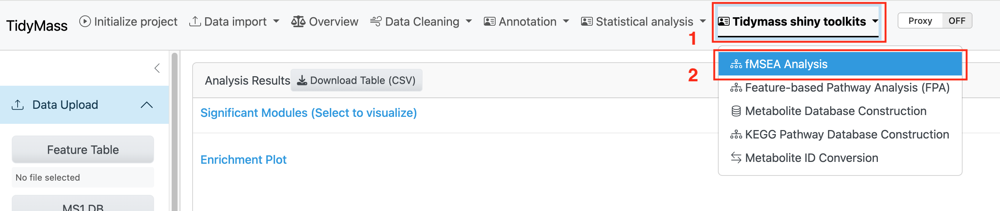
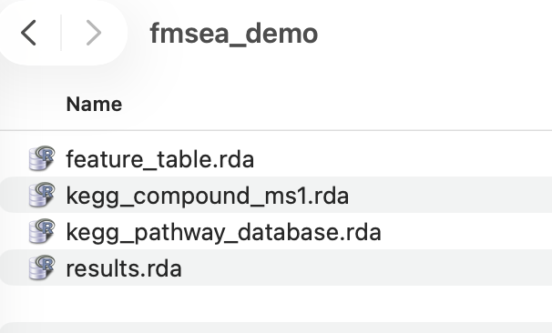
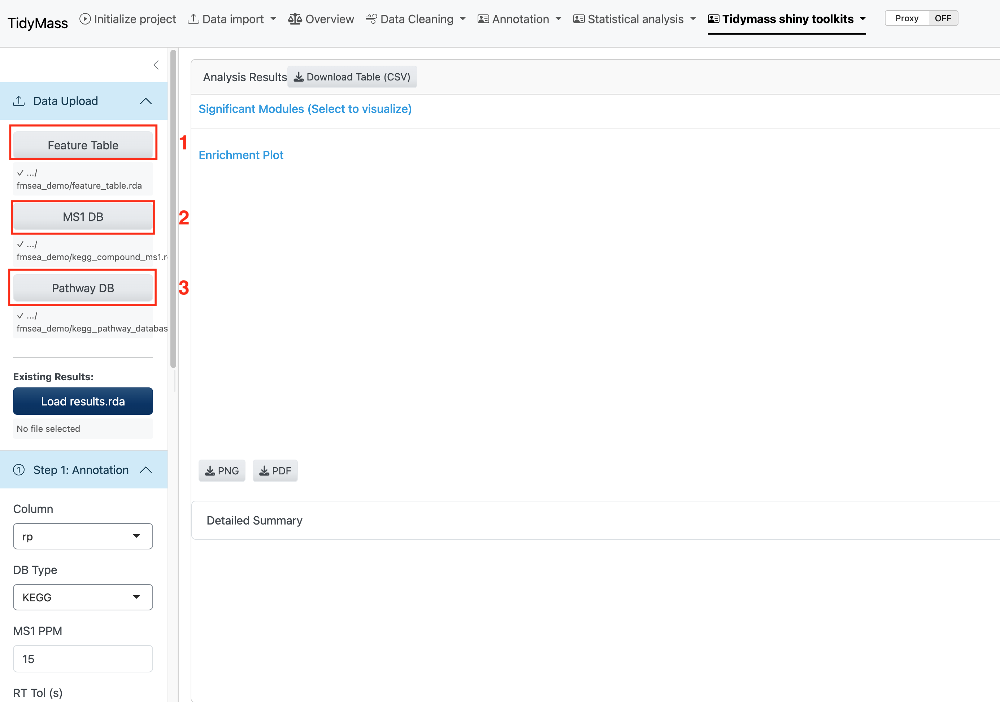
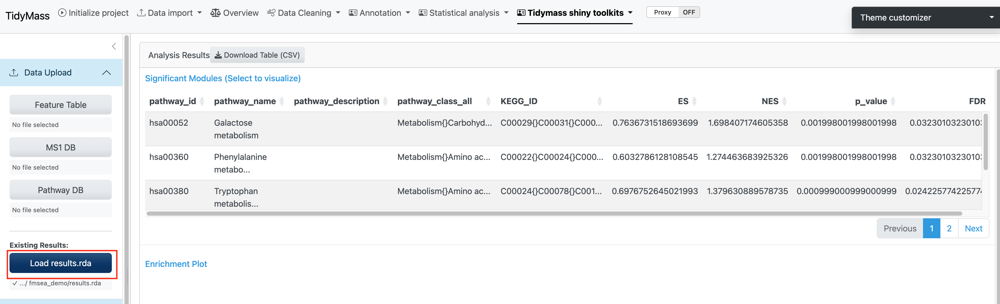
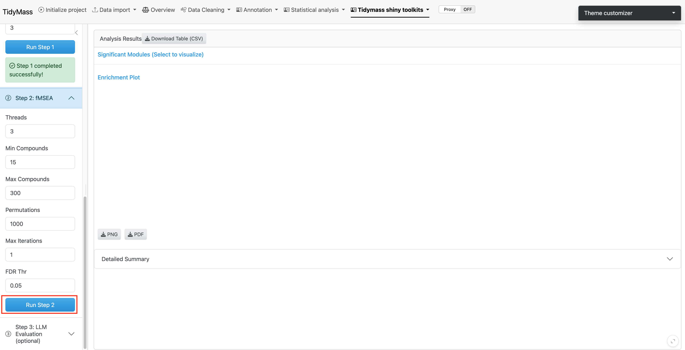
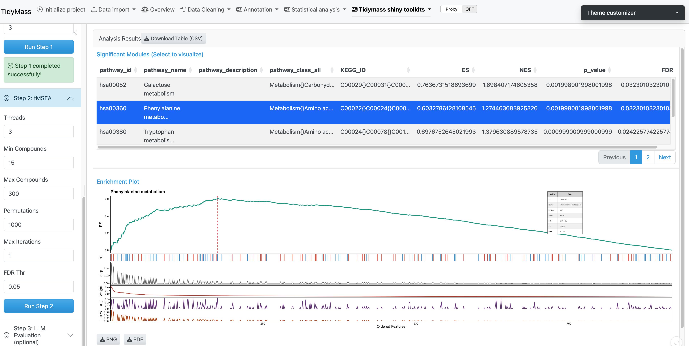

# Analysis Workflow {#analysis}

The featureMSEA shiny module walks you through the analysis in three sequential steps. Launch the TidyMass Shiny app and click **fMSEA Analysis** under **Tidymass Shiny Toolkits**.

```{r echo=FALSE, fig.cap="fMSEA Analysis module entry point"}

```

## Data Upload {#upload}

You need three required files in `.rda` format. Click the respective buttons to select each file.

```{r echo=FALSE, fig.cap="Data upload interface"}

```

**Required files:**

| File | Description |
|------|-------------|
| **Feature Table** | Processed feature table from your metabolomics experiment |
| **MS1 Database** | Metabolite database for annotation — KEGG or HMDB |
| **Pathway Database** | Pathway database — KEGG, HMDB, iMETpD, Reactome, or WikiPathways |

**Optional:**

| File | Description |
|------|-------------|
| **Existing Results** | A previously saved `fmsea_result.rda` to resume a prior analysis |

```{r echo=FALSE, fig.cap="Selecting input files"}

```

> **Shortcut:** If you already have a saved results object, upload it via **Existing Results** to skip Steps 1 and 2 entirely.

```{r echo=FALSE, fig.cap="Uploading an existing results object"}

```

---

## Step 1 — Annotation {#step1}

The first step annotates metabolic features against the MS1 database by matching *m/z* values.

```{r echo=FALSE, fig.cap="Step 1: annotation parameters"}
knitr::include_graphics("figures/fmsea_step1.png")
```

**Parameters:**

| Parameter | Description | Default |
|-----------|-------------|---------|
| `Column` | Chromatographic column type | `"rp"` |
| `DB Type` | Annotation database | `"KEGG"` |
| `MS1 PPM` | Mass accuracy threshold (ppm) | `15` |
| `RT Tol (s)` | Retention time tolerance for MFC clustering | `10` |
| `Isotope No.` | Maximum isotopes to consider | `3` |

Click **Run Step 1**. Annotation may take several minutes depending on feature count.

> **Tip:** `"rp"` (reverse phase) is appropriate for most lipidomics and metabolomics experiments; use `"hilic"` for polar metabolite profiling.

---

## Step 2 — Enrichment Analysis {#step2}

Step 2 uses the annotated features from Step 1 to run the GSEA-style pathway enrichment.

```{r echo=FALSE, fig.cap="Step 2: fMSEA analysis parameters"}

```

**Parameters:**

| Parameter | Description | Default |
|-----------|-------------|---------|
| `Threads` | Parallel processing threads | `3` |
| `Min Compounds` | Minimum pathway size (compounds) | `15` |
| `Max Compounds` | Maximum pathway size (compounds) | `300` |
| `Permutations` | Statistical permutations | `1000` |
| `Max Iterations` | Algorithm iterations | `1` |
| `FDR Thr` | FDR significance threshold | `0.05` |

Click **Run Step 2**. Analysis time scales with the number of permutations and detected pathways.

> **Note:** Increasing `Permutations` improves p-value precision but significantly increases runtime. `1000` is a good balance for exploratory analysis.

---

## Results Visualization {#results}

After Step 2 completes, results are displayed in an interactive two-panel interface:

- **Left panel — Significant Modules Table:** Lists all significantly enriched pathways with NES (Normalized Enrichment Score), p-value, and FDR. Click any row to update the enrichment plot.
- **Right panel — Enrichment Plot:** Displays the running enrichment score profile for the selected pathway.

```{r echo=FALSE, fig.cap="Results visualization: pathway table and enrichment plot"}

```

**Download options:**

- Pathway tables as **CSV**
- Enrichment plots as **PNG** or **PDF**
