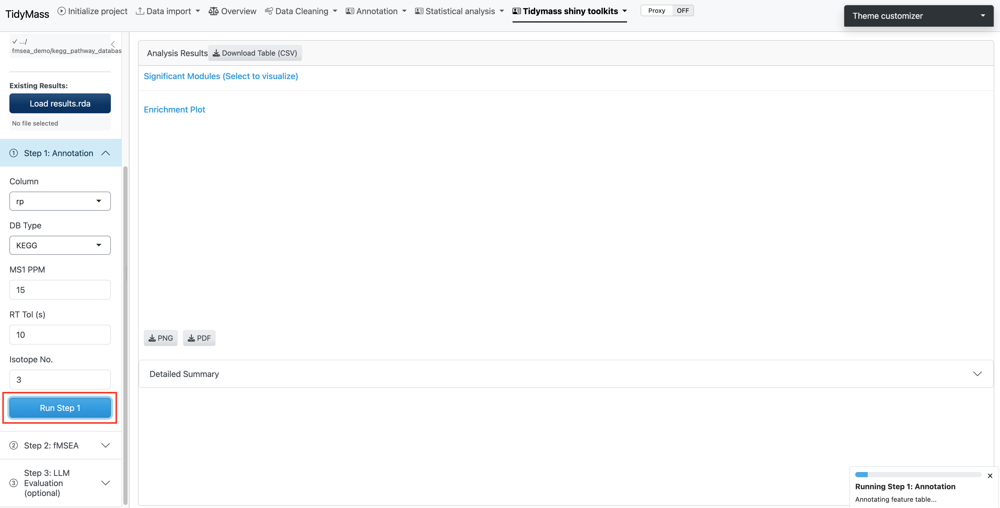

# Annotation and Filtering {#annotation}

Step 1 annotates metabolic features against the MS1 database by matching *m/z* values within a user-specified mass accuracy window. Co-eluting features are further grouped into **Metabolic Feature Clusters (MFCs)** based on retention time, which improves annotation confidence and reduces redundancy.

```{r echo=FALSE, fig.cap="Step 1: annotation and filtering parameters"}

```

## Parameters {#annotation-params}

| Parameter | Description | Default |
|-----------|-------------|---------|
| `Column` | Chromatographic column type | `"rp"` |
| `DB Type` | Annotation database | `"KEGG"` |
| `MS1 PPM` | Mass accuracy threshold (ppm) | `15` |
| `RT Tol (s)` | Retention time tolerance for MFC clustering | `10` |
| `Isotope No.` | Maximum isotopes considered per feature | `3` |

> **Tip:** Use `"rp"` (reverse phase) for most lipidomics and general metabolomics experiments. Switch to `"hilic"` for polar metabolite profiling.

Click **Run Step 1**. Annotation may take a few minutes depending on feature count. When complete, a summary of annotated features appears below the parameters panel.
