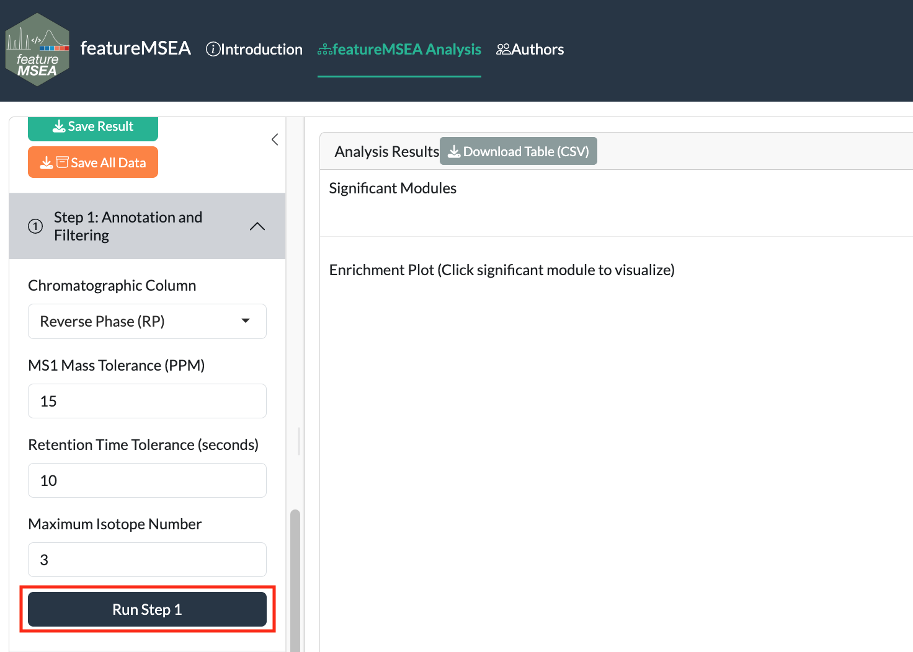
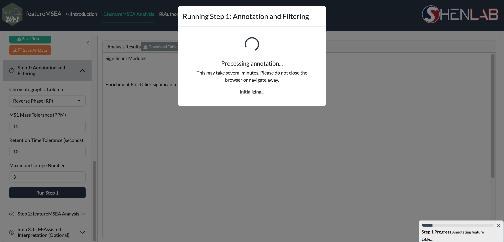

# Annotation and Filtering {#annotation}

In Step 1, metabolic features are annotated against the MS1 database via accurate mass matching within a user-specified tolerance window. Co-eluting features sharing similar retention times are further grouped into **Metabolic Feature Clusters (MFCs)**, a grouping strategy that improves annotation confidence and reduces redundancy in the resulting annotation table.

```{r echo=FALSE, fig.cap="Step 1: annotation and filtering parameters"}

```

## Parameters {#annotation-params}

| Parameter | Description | Default |
|-----------|-------------|---------|
| `Column` | Chromatographic column type | `"rp"` |
| `DB Type` | Annotation database | `"KEGG"` |
| `MS1 PPM` | Mass accuracy threshold (ppm) | `15` |
| `RT Tol (s)` | Retention time tolerance for MFC clustering | `10` |
| `Isotope No.` | Maximum isotopes considered per feature | `3` |

> **Tip:** Use `"rp"` (reverse phase) for most lipidomics and general metabolomics experiments. Switch to `"hilic"` for polar metabolite profiling.

Click **Run Step 1**. Annotation may take a few minutes depending on feature count.

```{r echo=FALSE, fig.cap="Step 1 running"}

```

When complete, a summary of annotated features appears below the parameters panel.
