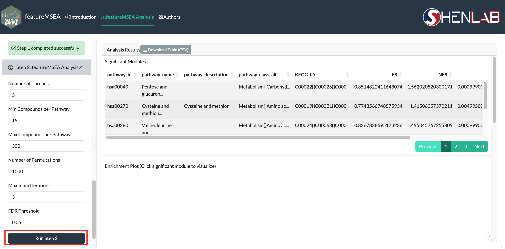

# featureMSEA Analysis {#fmsea-analysis}

Step 2 performs feature rank-based metabolite set enrichment scoring. Features are ranked according to a user-provided phenotype-associated statistic, and for each metabolite set, a running enrichment score is computed across the ranked feature list to evaluate whether features annotated to metabolites in that set are non-randomly concentrated toward the top of the ranking.

```{r echo=FALSE, fig.cap="Step 2: featureMSEA enrichment parameters"}

```

## Parameters {#analysis-params}

| Parameter | Description | Default |
|-----------|-------------|---------|
| `Threads` | Parallel processing threads | `3` |
| `Min Compounds` | Minimum pathway size (compounds) | `15` |
| `Max Compounds` | Maximum pathway size (compounds) | `300` |
| `Permutations` | Statistical permutations for p-value estimation | `1000` |
| `Max Iterations` | Algorithm iterations | `1` |
| `FDR Thr` | FDR significance threshold | `0.05` |

> **Note:** Increasing `Permutations` improves p-value precision but increases runtime proportionally. `1000` permutations gives a good balance for exploratory analysis; use `10,000`+ for publication-quality results.

Click **Run Step 2**. Run time scales with the number of permutations and the size of the pathway database. A progress bar is shown during computation.
