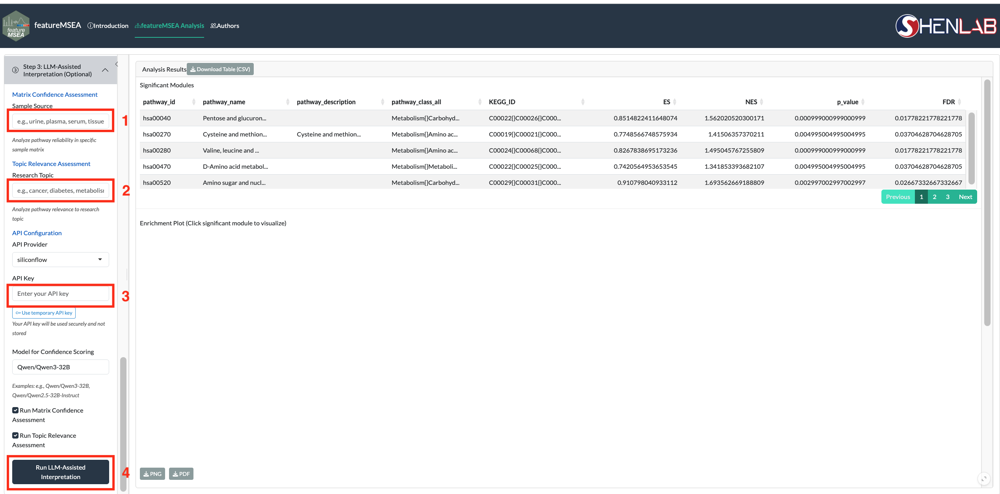
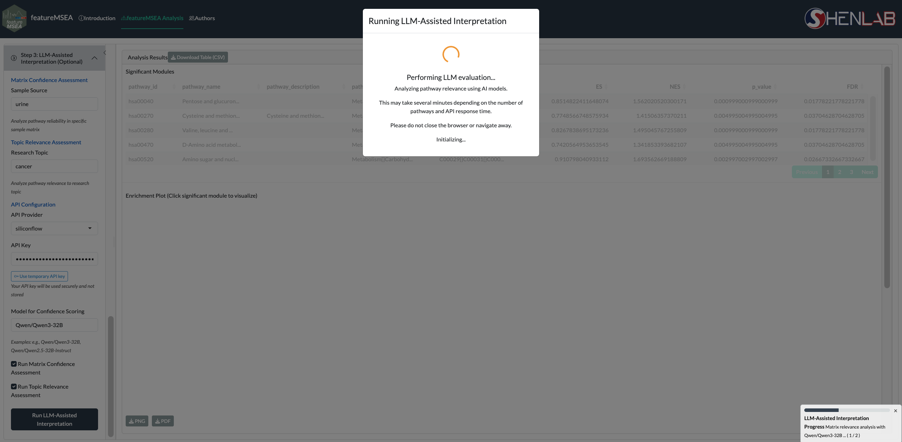

# LLM-assisted Interpretation {#llm-interpretation}

Step 3 is an **optional** module that uses Large Language Models (LLMs) to evaluate the biological plausibility of enriched metabolite sets identified in Step 2.

```{r echo=FALSE, fig.cap="LLM evaluation interface"}

```

## Evaluation modes {#modes}

### Matrix Confidence Assessment {#matrix-confidence}

Scores the biological plausibility of each enriched metabolite set within the specified biological sample matrix.

- **Input:** Biological matrix type (e.g., `"urine"`, `"plasma"`, `"serum"`, `"blood"`, `"feces"`)
- **Output:** Per-metabolite-set matrix confidence score (0–100) reflecting whether the metabolite set represents a coherent and biologically plausible biochemical entity within the specified sample matrix

### Topic Relevance Assessment {#topic-relevance}

Searches PubMed and scores each enriched metabolite set based on published evidence linking it to your specific research context.

- **Input:** Research topic (e.g., `"type 2 diabetes"`, `"colorectal cancer"`, `"pregnancy"`)
- **Output:** Per-metabolite-set topic relevance score with supporting PubMed literature (PMIDs)

## API configuration {#api}

featureMSEA supports two LLM providers:

| Provider | Model | Notes |
|----------|-------|-------|
| **SiliconFlow** *(default)* | Qwen series | Cost-effective; recommended for most users |
| **OpenAI** | GPT series | May produce more nuanced biological summaries |

Enter your API key in the **API Key** field before running. Keys are not stored or transmitted beyond the selected LLM provider.

## Running the evaluation {#running}

1. Enter the **Sample Source** (biological matrix) and/or **Research Topic**.
2. Check the analyses you want to run (both enabled by default).
3. Select your **API Provider** and enter your **API Key**.
4. Click **Run LLM Evaluation**.

```{r echo=FALSE, fig.cap="LLM evaluation running"}

```

Results are returned as a scored table per metabolite set. Download the full report via **Download LLM Evaluation**.

> **Caution:** LLM outputs are probabilistic. Always verify AI-generated interpretations against
> primary literature. Use this module to guide hypothesis generation, not to replace domain expertise.