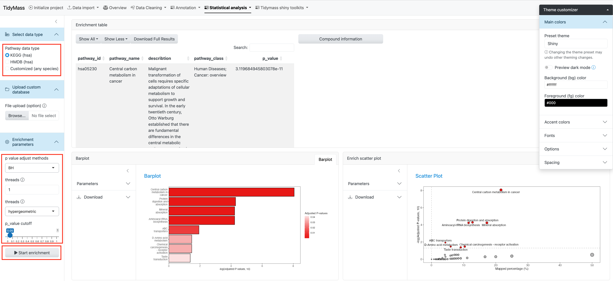

# Data Visualization {#visualization}

After Step 2 completes, results appear in an interactive two-panel interface. The left panel lists all significantly enriched pathways; clicking any row updates the enrichment plot on the right.

```{r echo=FALSE, fig.cap="Results visualization: pathway table and enrichment plot"}
knitr::include_graphics("figures/fmsea_visulization.png")
```

## Pathway table {#pathway-table}

The **Significant Modules Table** reports one row per enriched pathway with the following columns:

| Column | Description |
|--------|-------------|
| **Pathway** | Pathway name |
| **NES** | Normalized Enrichment Score (positive = up-regulated, negative = down-regulated) |
| **p-value** | Nominal p-value from permutation testing |
| **FDR** | Benjamini–Hochberg adjusted p-value |

Rows passing the FDR threshold (default 0.05) are highlighted.

## Enrichment plot {#enrichment-plot}

The enrichment plot shows the running enrichment score across the ranked feature list for the selected pathway. The peak of the curve indicates the leading edge — the subset of pathway members most responsible for the enrichment signal.

```{r echo=FALSE, fig.cap="Example enrichment score plot for a selected pathway"}

```

## Downloads {#downloads}

| Output | Format | Button |
|--------|--------|--------|
| Pathway enrichment table | CSV | **Download Table** |
| Enrichment score plot | PNG / PDF | **Download Plot** |
| Full results object | `.rda` | **Download Results** |

The `.rda` results file can be re-uploaded on a future session via **Existing Results** to skip Steps 1–2 and go directly to this panel.
