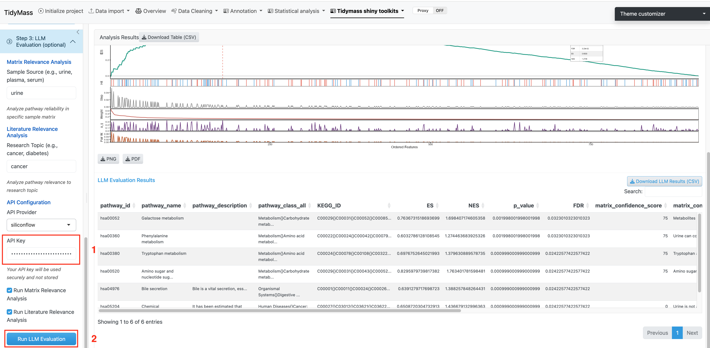

# LLM-assisted Interpretation {#llm-interpretation}

Step 3 is an **optional** module that uses Large Language Models (LLMs) to provide biological context for the enriched pathways identified in Step 2.

```{r echo=FALSE, fig.cap="LLM evaluation interface"}

```

## Evaluation modes {#modes}

### Matrix Relevance Analysis {#matrix}

Scores how reliably metabolites detected in your biological matrix are expected to reflect pathway activity.

- **Input:** Biological matrix type (e.g., `"urine"`, `"plasma"`, `"serum"`, `"blood"`, `"feces"`)
- **Output:** Per-pathway confidence score based on matrix–pathway reliability

### Literature Relevance Analysis {#literature}

Searches PubMed and scores each enriched pathway based on published evidence for your specific research context.

- **Input:** Research topic (e.g., `"type 2 diabetes"`, `"colorectal cancer"`, `"pregnancy"`)
- **Output:** Per-pathway literature support score with summarized evidence

## API configuration {#api}

featureMSEA supports two LLM providers:

| Provider | Model | Notes |
|----------|-------|-------|
| **SiliconFlow** *(default)* | Qwen series | Cost-effective; recommended for most users |
| **OpenAI** | GPT-4o / GPT-4 | May produce more nuanced biological summaries |

Enter your API key in the **API Key** field before running. Keys are not stored or transmitted beyond the selected LLM provider.

## Running the evaluation {#running}

1. Enter the **Sample Source** (biological matrix) and/or **Research Topic**.
2. Check the analyses you want to run (both enabled by default).
3. Select your **API Provider** and enter your **API Key**.
4. Click **Run LLM Evaluation**.

Results are returned as a scored table per pathway. Download the full report via **Download LLM Evaluation**.

> **Caution:** LLM outputs are probabilistic. Always verify AI-generated interpretations against primary literature. Use this module to guide hypothesis generation, not to replace domain expertise.
