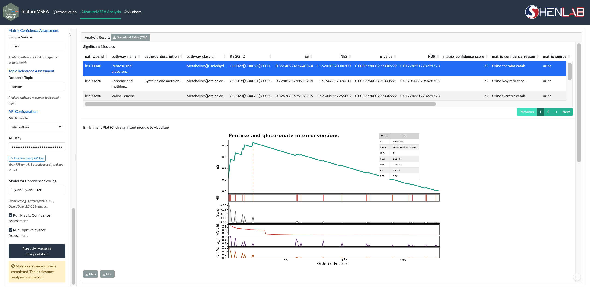
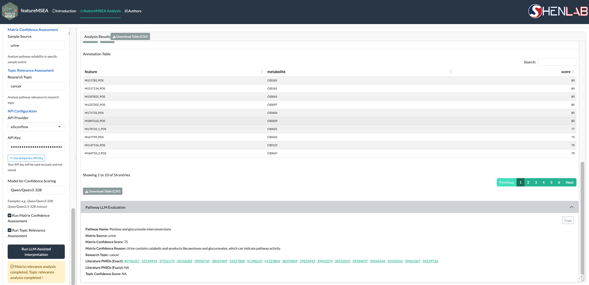

# Analysis Results {#results}

After Step 2 completes, results appear in the **Analysis Results** panel on the right. The panel is driven by row selection in the significant modules table — clicking a row updates the enrichment plot, annotation table, and LLM evaluation panel below.

## Significant Modules Table {#pathway-table}

The significant modules table lists all enriched metabolite sets that pass the FDR threshold. Each row contains:

| Column | Description |
|--------|-------------|
| **Pathway** | Metabolite set name |
| **NES** | Normalized Enrichment Score — positive indicates enrichment among top-ranked features, negative among bottom-ranked features |
| **p-value** | Nominal p-value from permutation testing |
| **FDR** | Benjamini–Hochberg adjusted p-value |

Clicking a row triggers the panels below. The full table can be exported via **Download Table (CSV)**.

```{r echo=FALSE, fig.cap="Selecting a significant module renders the enrichment plot below the table"}

```

The enrichment plot shows the running enrichment score across the ranked feature list for the selected metabolite set. The peak of the curve marks the leading edge — the subset of annotated features most responsible for the enrichment signal. Export the plot via **Download Plot** (PNG or PDF).

## Annotation Table and LLM Evaluation {#annotation-llm}

```{r echo=FALSE, fig.cap="Annotation table and Pathway LLM Evaluation panel"}

```

**Annotation Table** — lists the leading edge features for the selected metabolite set, showing feature-level annotation details for the compounds driving the enrichment. Export via **Download Table (CSV)**.

**Pathway LLM Evaluation** — populated only after Step 3 completes. Displays the following fields for the selected metabolite set:

| Field | Description |
|-------|-------------|
| **Pathway Name** | Metabolite set name |
| **Matrix Source** | Biological sample matrix provided in Step 3 |
| **Matrix Confidence Score** | LLM-assigned score (0–100) reflecting biological plausibility within the specified matrix |
| **Matrix Confidence Reason** | Reasoning behind the matrix confidence score |
| **Research Topic** | Research context provided in Step 3 |
| **Literature PMIDs (Exact)** | PubMed IDs from exact-match literature search — click to open in PubMed |
| **Literature PMIDs (Fuzzy)** | PubMed IDs from fuzzy-match literature search — click to open in PubMed |
| **Topic Confidence Score** | LLM-assigned score reflecting literature support for the metabolite set in the given research context |

If Step 3 has not been run, the LLM Evaluation panel does not appear.
